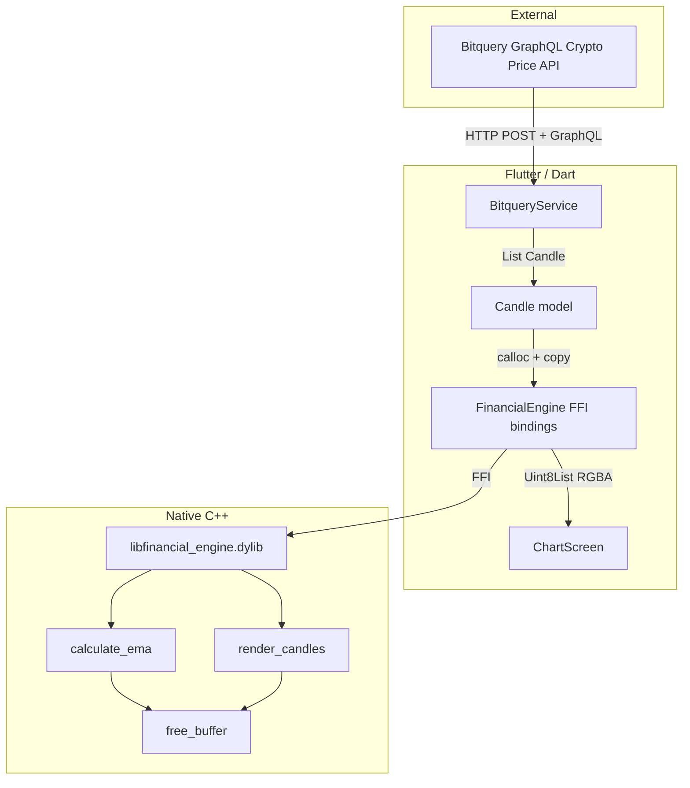

# Flutter Desktop + Native C++ Financial Engine (ETH Demo)

A macOS desktop application that fetches Ethereum OHLCV candlestick data via the Bitquery GraphQL API, processes it through a native C++ financial engine (EMA calculation, candlestick rendering), and displays the result in Flutter via Dart FFI. The chart draws candlesticks with an overlaid **EMA line** (Exponential Moving Average). An **EMA period selector** (9, 21, 50) lets you switch between different smoothing periods; changing the selection or clicking refresh redraws the chart with the chosen EMA.

## Project Goal

This project demonstrates:

- **FFI expertise**: Dart-to-C++ interop with strict memory ownership
- **Clean architecture**: Clear separation between data fetching (Dart), computation (C++), and rendering (Dart + native)
- **End-to-end flow**: Bitquery GraphQL → Dart models → Native structs → C++ engine → RGBA buffer → Flutter UI

---

## Architecture Overview



---

## Project Structure

```
flutter-desktop-ffi-graphql-demo/
├── native/                          # C++ financial engine
│   ├── CMakeLists.txt               # Build configuration
│   ├── include/
│   │   └── financial_engine.h       # Public C API
│   └── src/
│       ├── ema.cpp                  # EMA calculation
│       ├── renderer.cpp             # Candlestick → RGBA pixel buffer
│       └── financial_engine.cpp      # free_buffer implementation
│
├── lib/                             # Dart / Flutter
│   ├── main.dart                    # App entry, dotenv, MaterialApp
│   ├── models/
│   │   └── candle.dart             # OHLCV data class
│   ├── services/
│   │   └── bitquery_service.dart    # GraphQL fetch + JSON parsing
│   ├── ffi/
│   │   ├── native_candle.dart       # FFI Struct (C ABI layout)
│   │   └── engine_bindings.dart     # dylib load, FFI wrappers, memory mgmt
│   └── ui/
│       ├── chart_screen.dart        # Main screen, controls, error states
│       └── chart_painter.dart       # RGBA buffer → ui.Image
│
├── scripts/
│   ├── build_native.sh              # Build libfinancial_engine.dylib
│   └── run.sh                       # build_native + flutter run
│
├── macos/                           # Flutter macOS runner
│   └── Runner.xcodeproj             # Includes dylib copy build phase
│
├── .env.example                     # Template for BITQUERY_API_KEY
├── .env                             # Your API key (gitignored)
└── pubspec.yaml
```

---

## How It Works

### 1. Data Flow

| Step | Component | Action |
|------|-----------|--------|
| 1 | `BitqueryService` | POST GraphQL query to Bitquery (ETH, 1h, 200 candles) |
| 2 | `BitqueryService` | Parse JSON → `List<Candle>` |
| 3 | `FinancialEngine` | Allocate native memory (`calloc`), copy candles into `NativeCandle` structs |
| 4 | `FinancialEngine` | `calculateEma()` on close prices, then `render_candles()` with EMA overlay → RGBA pixel buffer |
| 5 | `FinancialEngine` | Copy buffer to `Uint8List`, free native buffers |
| 6 | `chart_painter.dart` | `decodeImageFromPixels()` → `ui.Image` |
| 7 | `ChartScreen` | Display via `RawImage` widget |

### 2. Component Relations

**BitqueryService** (`lib/services/bitquery_service.dart`)

- Fetches OHLCV data from Bitquery Crypto Price API (`https://streaming.bitquery.io/graphql`)
- Uses `Authorization: Bearer` header from `.env` (`BITQUERY_API_KEY`)
- Query: ETH (`bid:eth`), 1h interval, last 200 bars, last 14 days
- Returns `List<Candle>` with `timestamp`, `open`, `high`, `low`, `close`, `volume`

**Candle** (`lib/models/candle.dart`)

- Immutable Dart model for one OHLCV candle
- Mirrors the native `Candle` struct layout (see Struct Alignment below)

**FinancialEngine** (`lib/ffi/engine_bindings.dart`)

- Singleton that loads `libfinancial_engine.dylib` and binds native functions
- **`calculateEma(prices, period)`**: Allocates `double*`, calls native, copies result, frees
- **`renderCandles(candles, width, height, {ema})`**: Allocates `NativeCandle[]`, optionally passes EMA values for overlay, calls `render_candles`, copies RGBA to `Uint8List`, frees all
- Resolves dylib path: `Contents/Frameworks` → next to executable → project root

**Native Engine** (`native/`)

- **`calculate_ema`**: SMA-seeded EMA, multiplier `2/(period+1)`, heap-allocates result
- **`render_candles`**: Allocates `width × height × 4` bytes, draws wicks and bodies (green/red) onto dark background, optionally draws a bright 2px EMA line overlay when EMA data is provided
- **`free_buffer`**: Frees pointers returned by `calculate_ema` and `render_candles`

**ChartScreen** (`lib/ui/chart_screen.dart`)

- Fetches candles on load, renders chart (1200×600)
- **EMA period selector**: Dropdown for EMA 9, 21, or 50 — changing the period or clicking refresh immediately redraws the chart with the selected EMA line overlay
- Loading and error states

---

## Memory Ownership Model

### Rule: Every native allocation has an explicit free

| Allocator | Who frees | Where |
|-----------|-----------|-------|
| Dart `calloc` for `double[]` (EMA input) | Dart `calloc.free` | `engine_bindings.dart` |
| Dart `calloc` for `NativeCandle[]` | Dart `calloc.free` | `engine_bindings.dart` |
| Native `malloc` in `calculate_ema` | Dart calls `free_buffer` | `engine_bindings.dart` |
| Native `malloc` in `render_candles` | Dart calls `free_buffer` | `engine_bindings.dart` |

### Why `free_buffer` exists

The C++ engine allocates with `malloc` and returns raw pointers. Dart does not garbage-collect native memory. A single, well-defined `free_buffer(void* ptr)` function:

- Ensures consistent deallocation (no mixing `free` vs custom allocators)
- Keeps ownership clear: caller is responsible for freeing
- Makes it easy to audit: all native allocations go through `free_buffer`

### Try/finally pattern

```dart
final ptr = calloc<NativeCandle>(candles.length);
try {
  final bufferPtr = _renderCandles(...);
  try {
    return Uint8List.fromList(bufferPtr.asTypedList(size));
  } finally {
    _freeBuffer(bufferPtr.cast());
  }
} finally {
  calloc.free(ptr);
}
```

---

## Struct Alignment and ABI Compatibility

The native `Candle` struct and Dart `NativeCandle` must share the same memory layout:

**C (native):**
```c
typedef struct {
  int64_t timestamp;   // 8 bytes
  double open;         // 8 bytes
  double high;         // 8 bytes
  double low;          // 8 bytes
  double close;        // 8 bytes
  double volume;       // 8 bytes
} Candle;
```

**Dart (FFI Struct):**
```dart
base class NativeCandle extends Struct {
  @Int64()   external int timestamp;
  @Double()  external double open;
  @Double()  external double high;
  @Double()  external double low;
  @Double()  external double close;
  @Double()  external double volume;
}
```

All fields are 8-byte aligned. No padding is required, so the layout matches across the Dart/C boundary. This is critical for correct data when passing `Pointer<NativeCandle>` to native code.

---

## Why FFI Instead of Pure Dart?

| Aspect | Pure Dart | Native C++ via FFI |
|--------|-----------|--------------------|
| EMA | Straightforward | Same algorithm, can be faster for very large series |
| Candlestick rendering | Requires `dart:ui` Canvas or packages | Pure pixel buffer, no Flutter dependency, easy to scale |
| Memory control | GC-managed | Explicit `calloc`/`free`, predictable |
| Portability | Dart VM | Same C code can target other platforms (e.g. Linux, Windows) |
| Demos | Limited | Shows FFI, struct mapping, ABI, memory discipline |

For this demo, the main value is illustrating FFI patterns: struct mapping, memory ownership, and a clean boundary between Dart and native code. In production, native rendering can scale better for high-frequency charts (many candles, frequent redraws) because it avoids Flutter's layout and painting pipeline for the chart pixels.

---

## Prerequisites

- **Flutter SDK** (with macOS desktop support)
- **CMake** (for building the C++ engine)
- **Xcode** or **Xcode Command Line Tools** (for macOS builds)
- **Bitquery API key** ([get one](https://bitquery.io/))

---

## Setup

### 1. Clone and dependencies

```bash
cd flutter-desktop-ffi-graphql-demo
flutter pub get
```

### 2. API key

```bash
cp .env.example .env
# Edit .env and set:
# BITQUERY_API_KEY=your_bitquery_api_key
```

### 3. Build native engine

```bash
bash scripts/build_native.sh
```

This compiles `libfinancial_engine.dylib` and copies it to the project root. The macOS build copies it into the app bundle (`Contents/Frameworks`).

### 4. Run

```bash
bash scripts/run.sh
```

Or manually:

```bash
bash scripts/build_native.sh
flutter run -d macos
```

---

## Build Details

- **Native build**: `scripts/build_native.sh` runs CMake in `native/build`, then copies `libfinancial_engine.dylib` to the project root.
- **macOS app**: A Run Script phase in the Runner target copies the dylib from the project root into the app’s `Contents/Frameworks` folder.
- **Dylib resolution**: At runtime, the app looks for the dylib in:
  1. `Contents/Frameworks/` (bundled build)
  2. Next to the executable (`Contents/MacOS/`)
  3. Project root (manual run from repo)

---

## Production Considerations

| Current | Production |
|---------|------------|
| FFI on main isolate | Run FFI in `Isolate.run()` to avoid blocking UI |
| In-memory only | Stream/cache Bitquery data, handle reconnection |
| 1200×600 fixed chart | Responsive size, maybe `LayoutBuilder` or window resize |
| CPU rendering | Consider GPU (e.g. compute shaders, Metal) for very large datasets |
| Single dylib path | Support multiple platforms (Linux `.so`, Windows `.dll`) |

---

## Troubleshooting

**`libfinancial_engine.dylib not found`**

- Run `bash scripts/build_native.sh` before `flutter run`.
- Ensure the Run Script phase in Xcode ran (you should see `libfinancial_engine.dylib` in `build/.../Contents/Frameworks`).

**Bitquery API errors**

- Check `BITQUERY_API_KEY` in `.env`.
- Confirm the key has access to the Crypto Price / Trading API.
- Verify network connectivity to `https://streaming.bitquery.io/graphql`.

**No chart data**

- Bitquery may return no rows if the query filters are too strict or data is unavailable.
- Check the console for `BitqueryException` or GraphQL error messages.

---

## License

See the project license file.
